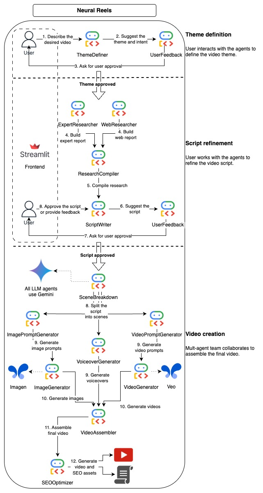
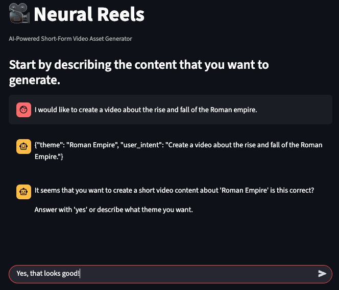

# Neural Reels - AI-Powered Short-Form Video Generator



**Neural Reels** is an AI-powered application that automates the creation of short-form video content from simple text prompts. It leverages a multi-agent system, where a main orchestrator agent coordinates a team of specialized AI agents to handle every step of the video production process—from research and scriptwriting to asset generation and the final video assembly.

This project uses the [Google Agent Development Kit (ADK)](https://google.github.io/adk-docs/) to build and orchestrate the agent-based workflow, with a user-friendly frontend created using [Streamlit](https://streamlit.io/), and all of the agents and asset generation (Voiceovers, images and videos) are powered by [Gemini](https://deepmind.google/models/gemini/) and other Google generative models (like [Imagen](https://deepmind.google/models/imagen/) and [Veo](https://deepmind.google/models/veo/)).

---

## How It Works

The application follows an interactive, multi-step workflow managed by the an orchestrator agent. This agent guides the user through the creative process, ensuring the final output aligns with their vision.

1.  **User Prompt**: The process begins in a chat interface where the user describes the video they want to create (e.g., "a video about the Roman Empire").
2.  **Theme Definition**: The `ThemeDefinerAgent` analyzes the prompt and proposes a specific video theme (e.g., "The Rise and Fall of the Roman Empire"). The user must approve this theme before the workflow continues.
3.  **Research & Compilation**: Once the theme is approved, the `ExpertResearcherAgent` and `WebResearcherAgent` gather information. The `ResearchCompilerAgent` then synthesizes this information into a concise report.
4.  **Script Writing & Refinement**: The `ScriptWriterAgent` drafts a script based on the research. The user is prompted for feedback and can request revisions until the script is approved.
5.  **Asset Generation**: With the final script, the system breaks it down into scenes. A team of agents then generates all necessary assets:
    *   `VoiceoverGeneratorAgent`: Creates audio narration for each scene using Text-to-Speech.
    *   `ImagePromptGeneratorAgent` & `VideoPromptGeneratorAgent`: Create detailed prompts for visual content.
    *   `ImageGeneratorAgent` & `VideoGeneratorAgent`: Generate images and video clips based on the prompts.
6.  **Video Assembly**: The `VideoAssemblerAgent` combines the voiceover, images, and video clips into a cohesive final video.
7.  **SEO Optimization**: Finally, the `SeoOptimizerAgent` generates a catchy title and a search-engine-optimized description for the video.

All generated assets and the final video are saved to a dedicated project folder.



## Getting Started

Follow these steps to set up and run the Neural Reels application on your local machine.

### Prerequisites

*   Python 3.10+
*   `uv` Python package manager (`pip install uv`)
*   A Google Cloud project with the Gemini API enabled.

### Installation

1.  **Clone the repository:**
    ```bash
    git clone https://github.com/dimitreOliveira/neural-reels.git
    cd neural-reels
    ```

2.  **Install dependencies:**
    The project uses `uv` for package management. Run the following command to install all required dependencies into a virtual environment.
    ```bash
    make install
    ```

### Environment Setup

1.  **Create a `.env` file** in the root directory of the project:
    ```bash
    cp .env.example .env
    ```

2.  **Add your Google API Key:**
    Obtain an API key from Google AI Studio and add it to your `.env` file:
    ```env
    GOOGLE_API_KEY="YOUR_API_KEY"
    ```

    Alternatively, you can set up Application Default Credentials (ADC) for authentication with Google Cloud:
    ```bash
    gcloud auth application-default login
    ```

## Usage

The application consists of a backend server (ADK) and a frontend UI (Streamlit). You can run them separately or together using the provided Makefile commands.

1.  **Start the Backend Server:**
    This command starts the ADK API server, which hosts the agent logic.
    ```bash
    make dev-backend
    ```

2.  **Start the Frontend UI:**
    In a separate terminal, run this command to launch the Streamlit web interface.
    ```bash
    make dev-frontend
    ```

3.  **Run Both (Combined Command):**
    To start both the backend and frontend simultaneously:
    ```bash
    make dev-app
    ```

4.  **Interact with the App:**
    *   Open the Streamlit URL provided in your terminal (usually `http://localhost:8501`).
    *   Click **"➕ New Session"** to begin.
    *   In the chat input, describe the video you want to create.
    *   Follow the agent's prompts to approve the theme and script. You can type "yes" to approve or provide feedback for revisions.
    *   Once the script is approved, the agent will begin generating all assets and assembling the final video.
    *   The generated video and all its assets will be saved in the `projects/` directory.

## Project Architecture

*   **Frontend (`frontend/`):** A user-friendly interface built with Streamlit that allows users to interact with the video creation agent in a conversational manner.
*   **Backend (`app/`):** An application built with the Google Agent Development Kit (ADK).
    *   **`agent.py`**: Contains the main `VideoCreatorWorkflowAgent`, which orchestrates the entire process.
    *   **`app/agents/`**: A directory containing all the specialized sub-agents, each responsible for a specific task in the workflow (e.g., `script_writer.py`, `image_generator.py`). This modular design allows for easy extension and maintenance.
    *   **`app/utils/`**: Utility functions for common tasks like API calls and file handling.

## Development

### Linting

To ensure code quality and consistency, run the linter and formatter before committing changes:
```bash
make lint
```

## Contributing

Contributions to this project are welcome! Please fork the repository, make your changes, and submit a pull request. Ensure your code passes the linting checks before submission.

## License

This project is licensed under the Apache License 2.0. See the LICENSE file for details.

## Acknowledgements

*   Google Cloud credits are provided for this project, this project was made possible with the support of the Google for Developers team.
*   Built with the Google Agent Development Kit (ADK).